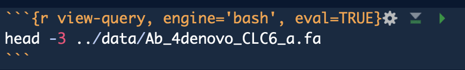

```{r setup, include=FALSE}
library(knitr)
library(tidyverse)
library(kableExtra)
knitr::opts_chunk$set(
  echo = TRUE,         # Display code chunks
  eval = FALSE,         # Evaluate code chunks
  warning = FALSE,     # Hide warnings
  message = FALSE,     # Hide messages
  fig.width = 6,       # Set plot width in inches
  fig.height = 4,      # Set plot height in inches
  fig.align = "center" # Align plots to the center
)
```

This is product offers a workflow to take a few thousand unidentified sequences and provide a better understanding of what genes are present. This will be accomplished through using Blast and protein sequenes from UniProt/Swiss-prot.


------------------------------------------------------------------------

A few weeks ago I perfected software installation, so I will not demonstrate that here. Please see this notebook for more.

# Database Creation

## Obtain Fasta (UniProt/Swiss-Prot)

This is from here picur reviewe sequences I named based on the identify of the database given

```{r time, eval=TRUE, echo=FALSE}
current_time <- format(Sys.time(), "%B %d, %Y %H:%M:%S")
cat("current date and time is ", current_time)
```

```{r download-data, engine='bash'}
cd ../data
curl -O https://ftp.uniprot.org/pub/databases/uniprot/current_release/knowledgebase/complete/uniprot_sprot.fasta.gz
mv uniprot_sprot.fasta.gz uniprot_sprot_r2023_01.fasta.gz
gunzip -k uniprot_sprot_r2023_01.fasta.gz
```

## Making the database

```{r make-blastdb, engine='bash'}
mkdir ../blastdb
/home/shared/ncbi-blast-2.11.0+/bin/makeblastdb \
-in ../data/uniprot_sprot_r2023_01.fasta \
-dbtype prot \
-out ../blastdb/uniprot_sprot_r2023_01
```

# Getting the query fasta file

```{r download-query, engine='bash'}
curl https://eagle.fish.washington.edu/cnidarian/Ab_4denovo_CLC6_a.fa \
-k \
> ../data/Ab_4denovo_CLC6_a.fa
```

Exploring what fasta file

```{r view-query, engine='bash', eval=TRUE}
head -3 ../data/Ab_4denovo_CLC6_a.fa
```

```{r view2-query, engine='bash', eval=TRUE}
echo "How many sequences are there?"
grep -c ">" ../data/Ab_4denovo_CLC6_a.fa
```

# Running Blastx

```{r blastx, engine='bash'}
~/applications/ncbi-blast-2.13.0+/bin/blastx \
-query ../data/Ab_4denovo_CLC6_a.fa \
-db ../blastdb/uniprot_sprot_r2023_01 \
-out ../output/Ab_4-uniprot_blastx.tab \
-evalue 1E-20 \
-num_threads 20 \
-max_target_seqs 1 \
-outfmt 6
```

```{r blast-look, engine='bash', eval=TRUE}
head -2 ../output/Ab_4-uniprot_blastx.tab
```

```{r blast-look2, engine='bash', eval=TRUE}
echo "Number of lines in output"
wc -l ../output/Ab_4-uniprot_blastx.tab
```

# Joining Blast table with annoations.

## Prepping Blast table for easy join

```{r separate, engine='bash', eval=TRUE}
tr '|' '\t' < ../output/Ab_4-uniprot_blastx.tab \
> ../output/Ab_4-uniprot_blastx_sep.tab

head -1 ../output/Ab_4-uniprot_blastx_sep.tab

```

## Could do some cool stuff in R here reading in table

```{r read-data, eval=TRUE, cache=TRUE}
bltabl <- read.csv("../output/Ab_4-uniprot_blastx_sep.tab", sep = '\t', header = FALSE)

spgo <- read.csv("https://gannet.fish.washington.edu/seashell/snaps/uniprot_table_r2023_01.tab", sep = '\t', header = TRUE)
```

```{r see, eval=TRUE, cache=TRUE}
kbl(
head(
  left_join(bltabl, spgo,  by = c("V3" = "Entry")) %>%
  select(V1, V3, V13, Protein.names, Organism, Gene.Ontology..biological.process., Gene.Ontology.IDs) %>% mutate(V1 = str_replace_all(V1, 
            pattern = "solid0078_20110412_FRAG_BC_WHITE_WHITE_F3_QV_SE_trimmed", replacement = "Ab"))
)
) %>%
  kable_styling(bootstrap_options = c("striped", "hover", "condensed", "responsive"))
```

```{r join}
annot_tab <-
  left_join(bltabl, spgo,  by = c("V3" = "Entry")) %>%
  select(V1, V3, V13, Protein.names, Organism, Gene.Ontology..biological.process., Gene.Ontology.IDs) %>% mutate(V1 = str_replace_all(V1, 
            pattern = "solid0078_20110412_FRAG_BC_WHITE_WHITE_F3_QV_SE_trimmed", replacement = "Ab"))
```


# Footnote

What you  see versus what is in Rmd

What the Rmd looks like...

```{r real, echo = FALSE, eval=TRUE, fig.align = "left"}

```


it post knit...

```{r view-query., engine='bash', eval=TRUE}
head -3 ../data/Ab_4denovo_CLC6_a.fa
```